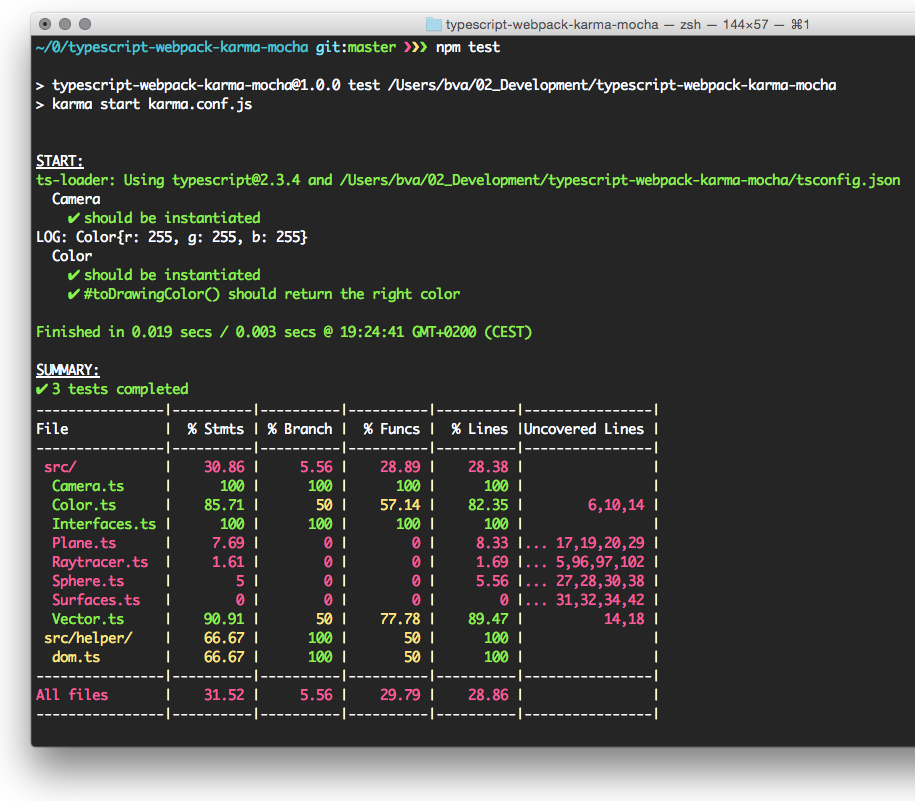

# typescript-webpack-karma-mocha
typescript-webpack-karma-mocha example

## install and run demo app

    npm install
    sudo npm install webpack --global
    webpack
    python -m SimpleHTTPServer 8080

## add typings and start karma

    sudo npm install typings --global
    typings install
    sudo npm install karma-cli --global
    karma start

## command line output

## used libraries

| Library | Version |
| -------------- |:--------------:|
| [karma](https://github.com/karma-runner/karma) | 1.7.0 |
| [webpack](https://github.com/webpack/webpack) | 2.6.1 |
| [karma-typescript](https://github.com/monounity/karma-typescript) | 3.0.3 |
| [typescript](https://github.com/Microsoft/TypeScript) | 2.3.3 |
| [karma-mocha](https://github.com/karma-runner/karma-mocha) | 1.3.0 |
| [karma-mocha-reporter](https://github.com/litixsoft/karma-mocha-reporter) | 2.2.3 |
| [mocha](https://github.com/mochajs/mocha) | 3.4.2 |
| [karma-chai](https://github.com/xdissent/karma-chai) | 0.1.0 |
| [chai](https://github.com/chaijs/chai) | 4.0.0 |
| [ts-loader](https://github.com/TypeStrong/ts-loader) | 2.1.0 |

| Library | Version |
| -------------- |:--------------:|
| nodejs | 8.1.0 |
| npm | 5.0.3 |
